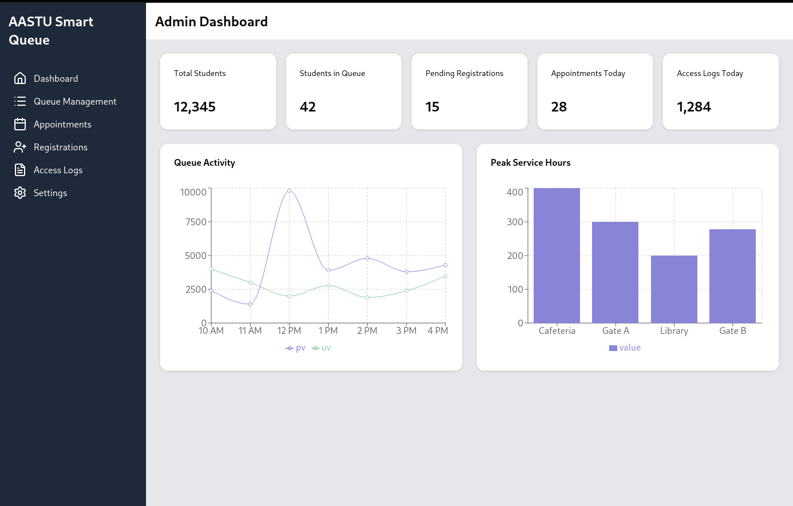
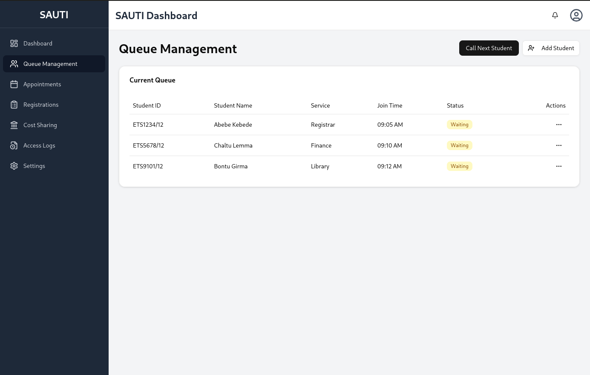
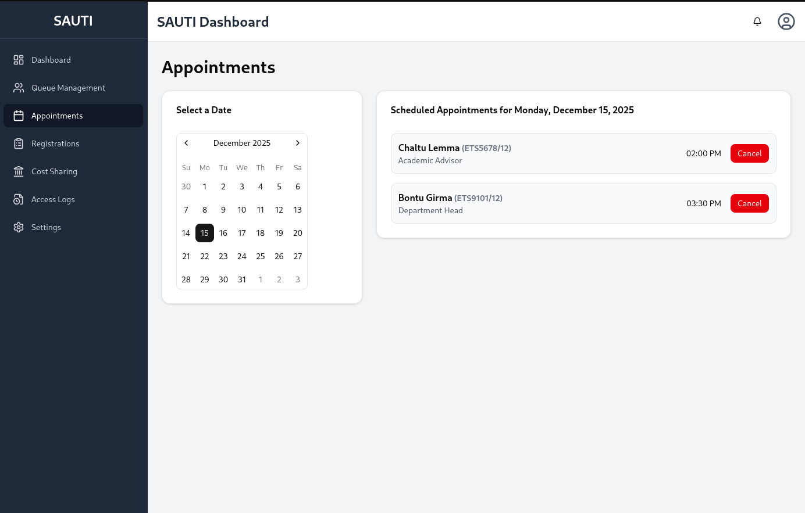
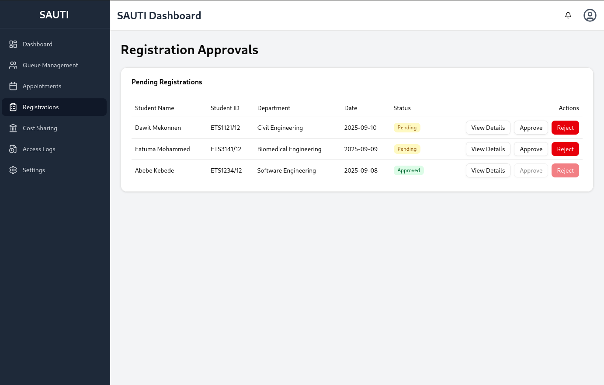
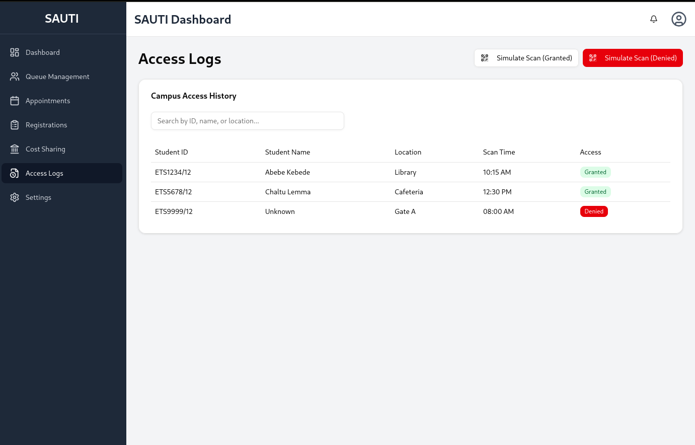
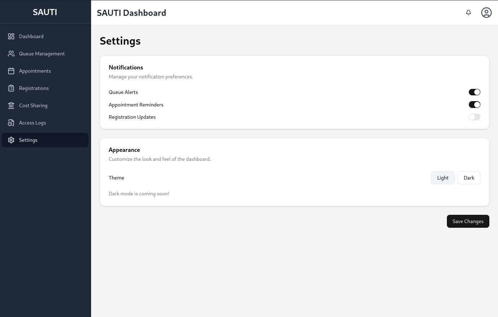
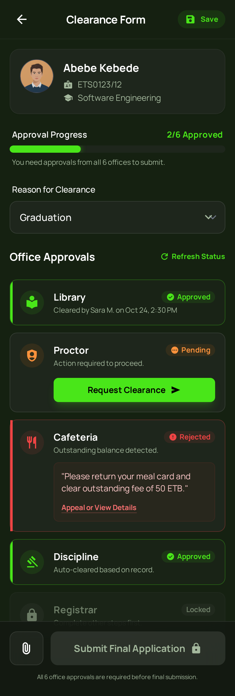

# AASTU-UniProcess-Hub
## Project Title:

AASTU SmartQueue & Digital Services System (ASQDS)
An integrated Smart Queue, Online Registration, Digital Forms, and Appointment Platform for Addis Ababa Science and Technology University.

# Table of Contents

1. [Project Title](#project-title)
2. [Mobile App Screenshots](#mobile-app-screenshots)
   - [Admin Dashboard: UniProcess Hub](#admin-dashboard-uniprocess-hub)
     - [Admin Overview](#admin-overview)
     - [Queue Management](#queue-management)
     - [Appointment Management](#appointment-management)
     - [Registration Management](#registration-management)
     - [Access Logs & Security](#access-logs--security)
     - [Admin Settings](#admin-settings)
     - [Student Clearance Form](#student-clearance-form)
3. [Introduction](#introduction)
   - [Purpose of the System](#11-purpose-of-the-system)
   - [Problem Statement](#12-problem-statement)
     - [Long Physical Queues](#long-physical-queues)
     - [Manual, Paper-Based Forms](#manual-paper-based-forms)
     - [Poor Scheduling and Service Management](#poor-scheduling-and-service-management)
     - [Inefficient Communication](#inefficient-communication)
     - [No Centralized Service Platform](#no-centralized-service-platform)
   - [Overall Impact](#overall-impact)
   - [System Solution Summary](#13-system-solution-summary)
   - [Stakeholders](#14-stakeholders)
4. [System Overview](#2-system-overview)
   - [Student Mobile App (Flutter)](#a-student-mobile-app-flutter)
   - [Admin Dashboard (Web)](#b-admin-dashboard-web)
   - [Firebase Backend](#c-firebase-backend)
#

# 📱 Mobile App Screenshots
## 🧑‍💼 Admin Dashboard: UniProcess Hub

### The Admin Dashboard enables university staff to manage queues, appointments, registrations, and system access logs in real time.

### 🖥️ Admin Overview

### 📋 Queue Management

### 📆 Appointment Management

### 📝 Registration Management

### 🔐 Access Logs & Security

Track user activity, login attempts, and system access history for accountability.

### ⚙️ Admin Settings

### 🧑‍💼 Student Clearance Form

# 1. Introduction
## 1.1 Purpose of the System

The purpose of ASQDS is to streamline and digitalize major administrative processes at AASTU. The system provides students with an efficient way to join queues, complete required forms online, and schedule appointments. It enables university offices—including registrar, departments, library, proctors, cafeteria, and discipline offices—to process forms and manage student flows efficiently through a centralized dashboard.

This SRS defines all functional and non-functional requirements for building the MVP.

## 1.2 Problem Statement

**AASTU students** face significant delays and inefficiencies in administrative processes due to the following problems:

### Long Physical Queues:
Students wait for hours for services such as registrar support, department approval, form signing, ID issuance, transcript requests, and clearance.

### Manual, Paper-Based Forms:
Important documents such as:
Application form (freshmen)
Cost-sharing form
Clearance form
are filled manually on paper, leading to:
Lost documents
Repetitive refilling
Human error
Long processing times
### Poor Scheduling and Service Management:
There is no unified appointment system. Students arrive randomly, creating overcrowding and delays for services that require in-person verification.

Inefficient Communication:
Students do not receive real-time updates about their service position, causing unnecessary waiting and crowding around offices.

No Centralized Service Platform:
Registrar, departments, library, cafeteria, discipline offices, and proctors all operate independently without a unified digital system, resulting in scattered processes.

## Overall Impact:
Students lose valuable learning time, offices operate inefficiently, and university operations remain slow, manual, and inconsistent.

## 1.3 System Solution Summary

ASQDS addresses these challenges by introducing:

**A mobile application for students\
A web dashboard for administrative offices\
A backend built entirely on Firebase**
### The system provides:

**Smart Digital Queue System\
Online Registration & PDF Form Submission (Freshmen & Readmission Students)\
Digital Cost-Sharing Form (PDF auto-fill + online submission) & PDF Form Submission (Freshmen & Readmission Students)\
Digital Clearance Form (multi-office approval workflow) & PDF Form Submission (Freshmen & Readmission Students)\
Appointment Booking System (Registrar, Departments, Library, Clearance)\
Real-time Notifications & Status Tracking\
Queue monitoring with predicted wait time
Admin Dashboard for reviewing, approving, and managing workflows**

## 1.4 Stakeholders

***Students (Freshmen, Returning, Readmission, Graduating/Withdrawing)\
Registrar Office\
Academic Departments (12 Departments)\
Library\
Dorm Proctors\
Student Cafeteria Administration\
Student Discipline Office\
System Administrators***

# 2. System Overview

The system consists of:

## A. Student Mobile App (Flutter)

Core student features:

Join smart queues

See real-time queue status

Receive notifications

Fill digital application, cost-sharing, and clearance forms

Generate/submit PDFs

Book appointments

Track approval processes

## B. Admin Dashboard (Web)

Used by:

Registrar

Departments

Library

Cafeteria

Proctors

Discipline Office

Core features:

Manage queues

Approve/reject forms

Digitally sign forms

View appointment schedules

Update student status

Upload schedules for registration & clearance periods

## C. Firebase Backend

Authentication

Firestore Database

Storage for PDFs & digital signatures

Cloud Functions for workflow automation

Cloud Messaging for notifications